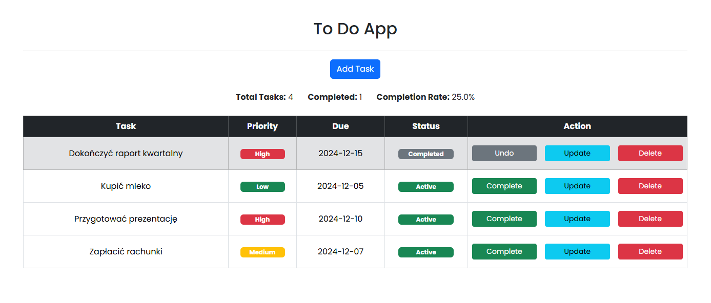

# To Do App - Spring & MySQL

This is a simple web application for managing tasks, built using the Spring framework, Spring Data JPA, Thymeleaf for the frontend, and MySQL as the database.

## Features

*   **List Tasks:** View all tasks in a table format.
*   **Task Statistics:** Display the total number of tasks, the number of completed tasks, and the completion percentage.
*   **Add Task:** Create new tasks with a title, priority, and due date.
*   **Update Task:** Modify the details of existing tasks.
*   **Delete Task:** Remove tasks from the list.
*   **Change Status:** Mark tasks as completed or active (toggle).
*   **Priorities:** Tasks are associated with priorities (e.g., High, Medium, Low) which are visually indicated. <br/><br/>
 <br/><br/>

## Technology Stack

*   **Backend:** Java, Spring Boot, Spring MVC, Spring Data JPA
*   **Database:** MySQL
*   **ORM:** Hibernate
*   **Frontend:** Thymeleaf, HTML, Bootstrap 5
*   **Build Tool:** Maven

## Requirements

To run this application locally, you will need:
- Java Development Kit (JDK) 23
- Maven 3.8+ 
- MySQL Workbench
- Git

For Docker deployment:
- Docker
- Docker Compose

## Local Setup

### 1. Clone the repository

```bash
git clone git@github.com:montelzek/todo-app.git
cd todo-app
```

### 2. Configure Database

Open MySQL Workbench and create a database:

Execute:

```sql
CREATE DATABASE IF NOT EXISTS todo;
USE todo;

CREATE TABLE priorities (
    priority_id INT PRIMARY KEY AUTO_INCREMENT,
    grade VARCHAR(20) NOT NULL,
    level INT NOT NULL
);

CREATE TABLE tasks (
    task_id INT PRIMARY KEY AUTO_INCREMENT,
    title VARCHAR(200) NOT NULL,
    priority_id INT,
    due_date DATE,
    is_completed BOOLEAN DEFAULT FALSE,
    created_at TIMESTAMP DEFAULT CURRENT_TIMESTAMP,
    FOREIGN KEY (priority_id) REFERENCES priorities(priority_id)
);

INSERT INTO priorities (grade, level) VALUES ('High', 1), ('Medium', 2), ('Low', 3);
```

### 3. Configure Application Properties

Modify `src/main/resources/application.properties` according to your MySQL setup:

```properties
spring.application.name=todoapp
spring.datasource.url=jdbc:mysql://localhost:3306/todo?useSSL=false&allowPublicKeyRetrieval=true&createDatabaseIfNotExist=true&autoReconnect=true&useUnicode=true&characterEncoding=UTF-8
spring.datasource.username=your_mysql_user
spring.datasource.password=your_mysql_password
spring.jpa.hibernate.ddl-auto=update
spring.jpa.properties.hibernate.dialect=org.hibernate.dialect.MySQL8Dialect
```

### 4. Build and Run

Build the application:

```bash
mvn clean package
```

Run the application:

```bash
java -Dfile.encoding=UTF-8 -jar target/todoapp-*.jar
```

The application will be available at: http://localhost:8080

## Docker Setup

### 1. Clone the repository

```bash
git clone git@github.com:montelzek/todo-app.git
cd todo-app
```

### 2. Build the application

```bash
mvn clean package
```

### 3. Run with Docker Compose

```bash
docker compose up -d
```

The application will be available at: http://localhost:8080

### 4. Stop the Docker containers

```bash
docker compose down
```

To also remove volumes:

```bash
docker compose down -v
```
